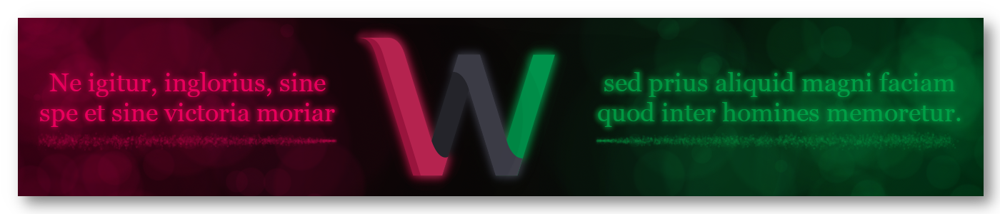

# About Me

Hello, world ! I am known as **Wilhelm Bismarck**, and I'm a 🇫🇷 french student in computing and programming.
I started programming at the age of 7 with [Scratch](https://scratch.mit.edu/) 2.0, loved it, and now study it.

I'm a proud Toulousian, especially when I have to say *Chocolatine*.

- Also known as `Bismarck_WB` | `BismarckWB` | `wilhelmbismarck`
- Write in `python` | `ruby` | `c` | `java`

[See more](https://scratch.mit.edu/projects/859566841/) about me.

----

🇫🇷 *Sacrebleu !*

Je suis un Toulousain adepte de Scratch, et étudiant en ingénérie informatique en CPGE.

Mes francophones adorés, je vous [invite à rejoindre](https://discord.gg/UnjbyEEVak) la **Communauté non officielle Scratch Francophone** (`COSFR`), un serveur Discord d'entraide et de détente pour scratcheurs francophones.

----

----

----
